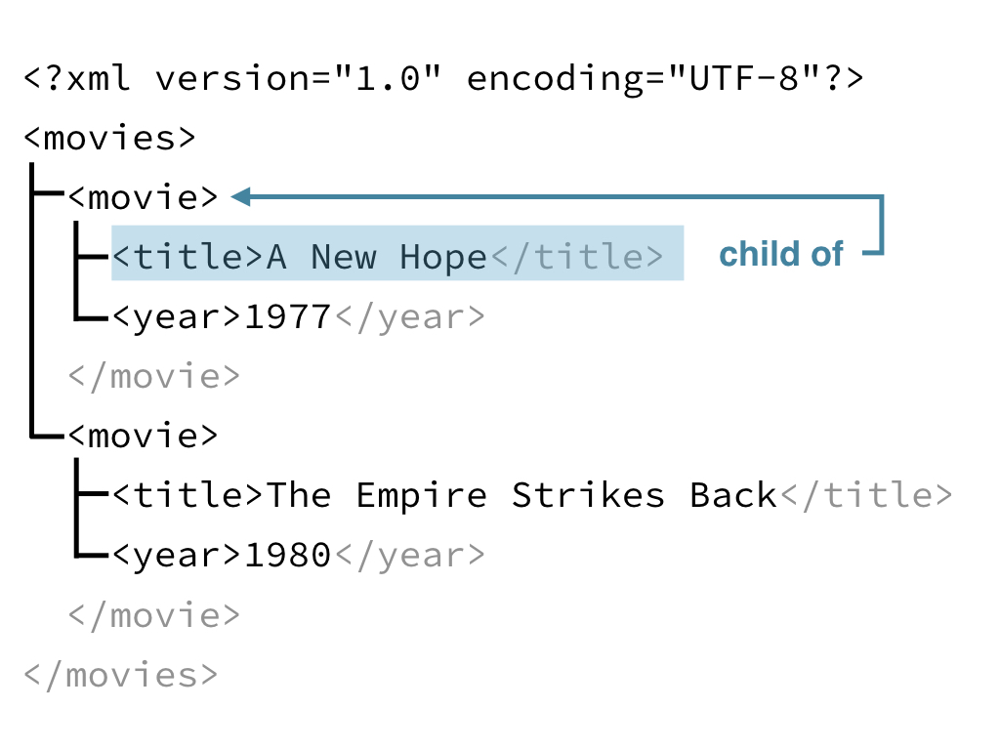
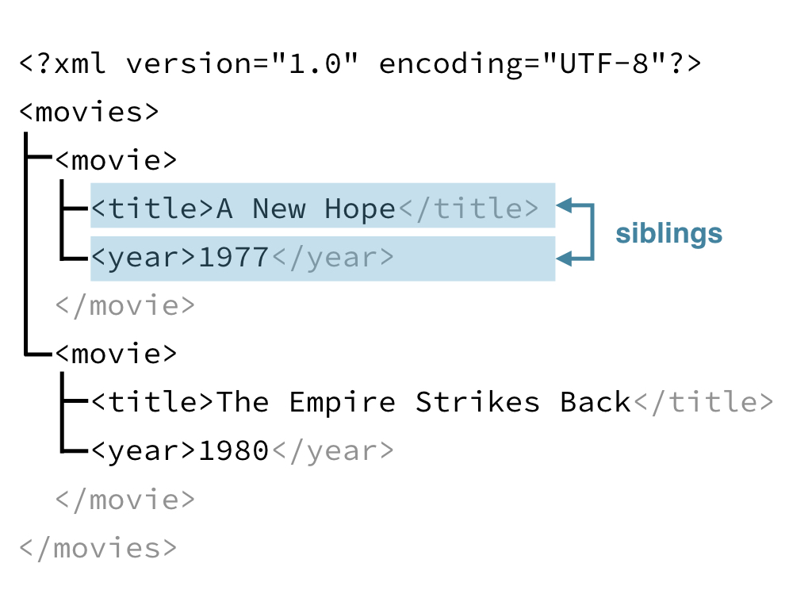
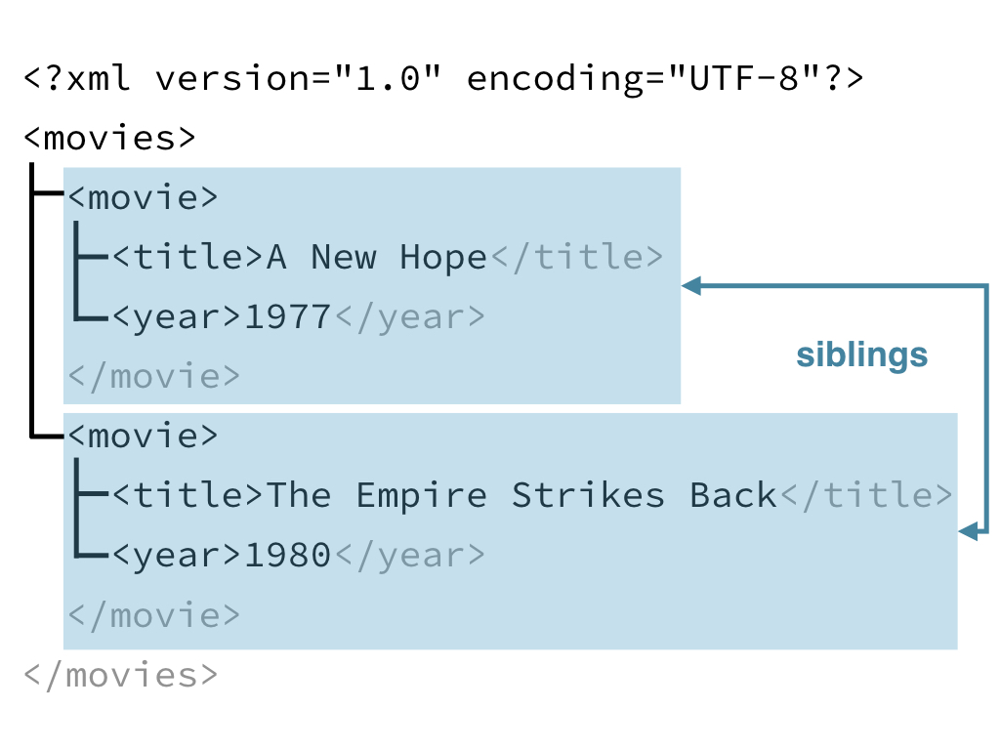

# JSON

JSON 格式常用于 Web 的数据传输

一般有两种格式，参考[DataCamp](https://campus.datacamp.com/courses/working-with-web-data-in-r/handling-json-and-xml?ex=1)

1. objects: `{"title" : "A New Hope", "year" : "1977"}`
1. arrays: `[1977, 1980]`

`http_type`帮助知道反馈的值是不是json格式。

```
> library(httr)
> url <- "http://httpbin.org/get" > r <- GET(url)
> http_type(r)
[1] "application/json"
```


```
[{ 
   "first_name": "Jason",
   "last_name": "Bourne",
   "occupation": "Spy"
 },
{
  "first_name": "Jason",
  "last_name": "Voorhees",
  "occupation": "Mass murderer"
}]
```

1. 首先是一个array
1. 其次含有两个jason (音译，参考[DataCamp](https://campus.datacamp.com/courses/working-with-web-data-in-r/handling-json-and-xml?ex=2))

>
`as = "text"` will return the content as a character string which is useful for checking the content is as you expect.

```
> writeLines(content(r, as = "text"))
No encoding supplied: defaulting to UTF-8.
{
    "args": {}, 
    "headers": {
        "Accept": "application/json, text/xml, application/xml, */*", "Accept-Encoding": "gzip, deflate",
        "Connection": "close",
        "Host": "httpbin.org",
        "User-Agent": "libcurl/7.54.0 r-curl/2.8.1 httr/1.2.1" 
    },
    "origin": "98.232.182.170",
    "url": "http://httpbin.org/get" 
}
```


```{r eval=F}
fromJSON(content(resp_json, as = "text"))
```

# Manipulating JSON

1. 主要使用 rlist, base, tidyverse 包
1. 主要使用`fromJSON`函数解析 JSON 格式

<input type="checkbox" id="checkbox1" class="styled">查询之前rlist的学习笔记

```{r eval=F}
# Load rlist
library(rlist)

# Examine output of this code
str(content(resp_json), max.level = 4)

# Store revision list
revs <- content(resp_json)$query$pages$`41916270`$revisions

# Extract the user element
user_time <- list.select(revs,user,timestamp)

# Print user_time
user_time

# Stack to turn into a data frame
list.stack(user_time)
```

对于反馈的json格式

1. `list.select`选择对应的变量
1. `list.stack`对应的list，转换成 data frame

但是 `dplyr::bind_rows` 也可以处理简单的 list 数据

```{r eval=F}
revs %>%
  bind_rows %>%           
  # 这里就合并了list，并处理成 data frame
  select(user, timestamp)
```

# XML

XML 也是 API 传数据的主要格式
XML 的数据类型可以认为是一个 Family Tree，
以下介绍
XML的

1. 数据构成
1. 数据联系

```
<?xml version="1.0" encoding="UTF-8"?>
<movies>
  <movie>
    <title>A New Hope</title>
    <year>1977</year>
  </movie>
  <movie>
    <title>The Empire Strikes Back</title>
    <year>1980</year>
  </movie>
</movies>
```


构成上主要是markup和content

1. markup - 描述数据结构
1. content - 数据本身

同时 markup 含有 attr-value，attr 也就是 metadata，也就是content 这个 data 的 data。

```{r}



```


<input type="checkbox" id="checkbox1" class="styled">[RStudio Community](https://community.rstudio.com/)提问here，没有联想功能


```{r eval=F}
# Load xml2
library(xml2)

# Get XML revision history
resp_xml <- rev_history("Hadley Wickham", format = "xml")

# Check response is XML 
http_type(resp_xml)

# Examine returned text with content()
rev_text <- content(resp_xml,as = "text")
rev_text

# Turn rev_text into an XML document
rev_xml <- read_xml(rev_text)

# Examine the structure of rev_xml
xml_structure(rev_xml)
```

所以实际上GET或者POST的请求，也是需要`read_*`

```
> xml_structure(rev_xml)
<api>
  <continue [rvcontinue, continue]>
  <query>
    <pages>
      <page [_idx, pageid, ns, title]>
        <revisions>
          <rev [user, anon, timestamp, comment, contentformat, contentmodel, space]>
            {text}
          <rev [user, anon, timestamp, comment, contentformat, contentmodel, space]>
            {text}
          <rev [user, timestamp, comment, contentformat, contentmodel, space]>
            {text}
          <rev [user, timestamp, comment, contentformat, contentmodel, space]>
            {text}
          <rev [user, timestamp, comment, contentformat, contentmodel, space]>
            {text}
```

`xml_structure`函数帮助查看xml的格式。

XPATHs 是专门用于提取XML格式数据的语言。

```{r eval=F}
library(xml2)
movies_xml <- read_xml('
<?xml version="1.0" encoding="UTF-8"?>
<movies>
  <title>"Star Wars"</title>
  <movie episode = "IV">
    <title>A New Hope</title>
    <year>1977</year>
  </movie>
  <movie episode = "V">
    <title>The Empire Strikes Back</title>
    <year>1980</year>
  </movie>
</movies>')
```

<input type="checkbox" id="checkbox1" class="styled">`read_xml`报错

```
Error in doc_parse_raw(x, encoding = encoding, base_url = base_url, as_html = as_html, : XML declaration allowed only at the start of the document [64]
```

XPATHs 类似于[HTTP访问](ch2.Rmd)的的第一种形式

```{r eval=F}
xml_find_all(movies_xml, xpath = "/movies/movie/title")
```

```
> xml_find_all(movies_xml, xpath = "/movies/movie/title")
{xml_nodeset (2)}
[1] <title>A New Hope</title>
[2] <title>The Empire Strikes Back</title>
```

```
# Extract contents with xml_text()
> xml_text(title_nodes)
[1] "A New Hope"              "The Empire Strikes Back"
```

```
> xml_find_all(movies_xml, "//title")
{xml_nodeset (3)}
[1] <title>"Star Wars"</title>
[2] <title>A New Hope</title>
[3] <title>The Empire Strikes Back</title>
```

`//`类似于shell里的`../`

```
> xml_find_all(movies_xml, "//movie/@episode")
  {xml_nodeset (2)}
  [1]  episode="IV"
  [2]  episode="V"
```

`@`提取attr。
或者使用`xml_attrs()`

nodeset - a list of nodes

`xml_text()` (or `xml_double()` or `xml_integer()`)

```{r eval=F}
# Find all nodes using XPATH "/api/query/pages/page/revisions/rev"
xml_find_all(rev_xml, "/api/query/pages/page/revisions/rev")

# Find all rev nodes anywhere in document
rev_nodes <- xml_find_all(rev_xml, "//rev")

# Use xml_text() to get text from rev_nodes
xml_text(rev_nodes)
```

<input type="checkbox" id="checkbox1" class="styled">可以再Stack Overflow上回复问题了

1. `xml_attrs()` takes a nodeset and returns all of the attributes for every node in the nodeset. 
1.`xml_attr()` takes a nodeset and an additional argument attr to extract a single named argument from each node in the nodeset.

终于知道这两个函数的意义了。

>
`xml_find_first()` in the sample code. It works just like `xml_find_all()` but it only extracts the first node it finds.

```{r}
# All rev nodes
rev_nodes <- xml_find_all(rev_xml, "//rev")

# The first rev node
first_rev_node <- xml_find_first(rev_xml, "//rev")

# Find all attributes with xml_attrs()
xml_attrs(first_rev_node)

# Find user attribute with xml_attr()
xml_attr(first_rev_node, "user")

# Find user attribute for all rev nodes
xml_attr(rev_nodes, "user")

# Find anon attribute for all rev nodes
xml_attr(rev_nodes, "anon")
```

<input type="checkbox" id="checkbox1" class="styled">之后这个例子肯定要换

>
if a node didn't have the anon attribute `xml_attr()` returned an `NA`

```
> # All rev nodes
> rev_nodes <- xml_find_all(rev_xml, "//rev")
> 
> # The first rev node
> first_rev_node <- xml_find_first(rev_xml, "//rev")
> 
> # Find all attributes with xml_attrs()
> xml_attrs(first_rev_node)
                  user                   anon              timestamp 
      "214.28.226.251"                     "" "2015-01-14T17:12:45Z" 
               comment          contentformat           contentmodel 
                    ""          "text/x-wiki"             "wikitext" 
                 space 
            "preserve"
> 
> # Find user attribute with xml_attr()
> xml_attr(first_rev_node, "user")
[1] "214.28.226.251"
> 
> # Find user attribute for all rev nodes
> xml_attr(rev_nodes, "user")
[1] "214.28.226.251" "73.183.151.193" "FeanorStar7"    "KasparBot"     
[5] "Spkal"
> 
> # Find anon attribute for all rev nodes
> xml_attr(rev_nodes, "anon")
[1] "" "" NA NA NA
```

总结

```{r}
get_revision_history <- function(article_title){
  # Get raw revision response
  rev_resp <- rev_history(article_title, format = "xml")
  
  # Turn the content() of rev_resp into XML
  rev_xml <- read_xml(content(rev_resp, "text"))
  
  # Find revision nodes
  rev_nodes <- xml_find_all(rev_xml, '//rev')

  # Parse out usernames
  user <- xml_attr(rev_nodes, "user")
  
  # Parse out timestamps
  timestamp <- readr::parse_datetime(xml_attr(rev_nodes, "timestamp"))
  
  # Parse out content
  content <- xml_text(rev_nodes)
  
  # Return data frame 
  data.frame(user = user,
    timestamp = timestamp,
    content = substr(content, 1, 40))
}

# Call function for "Hadley Wickham"
get_revision_history(article_title = "Hadley Wickham")
```

每个数据也是单独取出来，然后建立data frame。