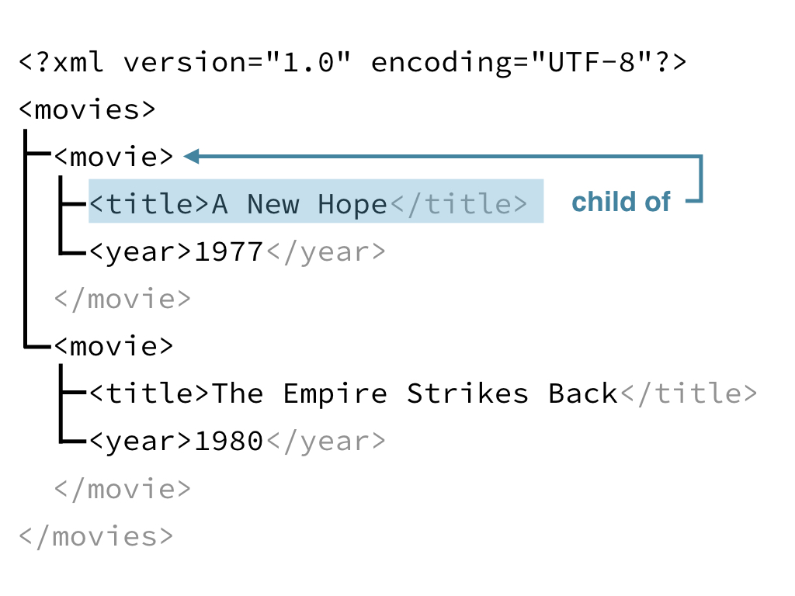
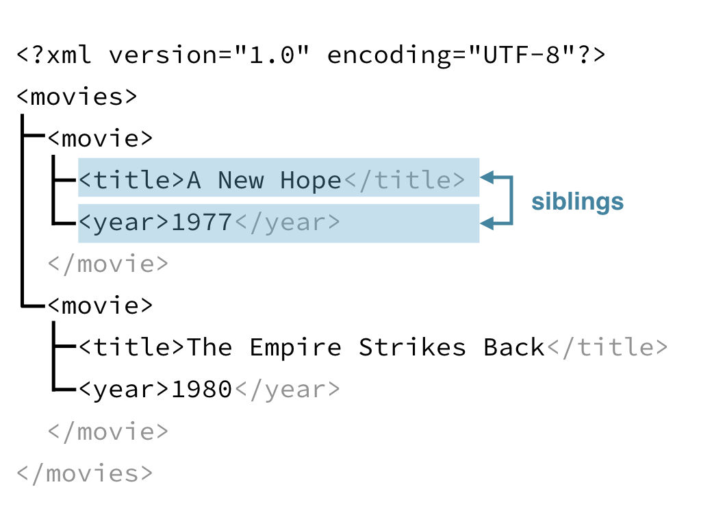
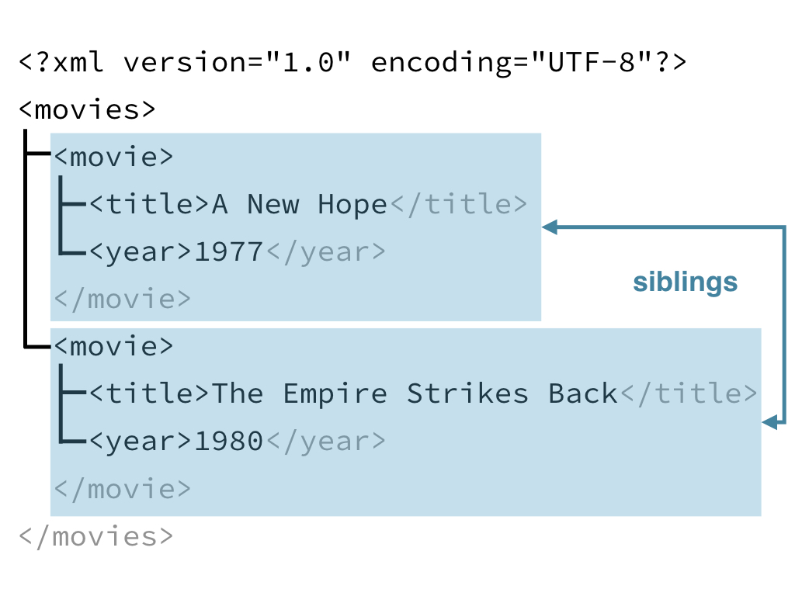

# JSON

JSON 格式常用于 Web
的数据传输

一般有两种格式，参考[DataCamp](https://campus.datacamp.com/courses/working-with-web-data-in-r/handling-json-and-xml?ex=1)

1.  objects: `{"title" : "A New Hope", "year" : "1977"}`
2.  arrays: `[1977, 1980]`

`http_type`帮助知道反馈的值是不是json格式。

    > library(httr)
    > url <- "http://httpbin.org/get" > r <- GET(url)
    > http_type(r)
    [1] "application/json"

    [{ 
       "first_name": "Jason",
       "last_name": "Bourne",
       "occupation": "Spy"
     },
    {
      "first_name": "Jason",
      "last_name": "Voorhees",
      "occupation": "Mass murderer"
    }]

1.  首先是一个array
2.  其次含有两个jason
    (音译，参考[DataCamp](https://campus.datacamp.com/courses/working-with-web-data-in-r/handling-json-and-xml?ex=2))

> `as = "text"` will return the content as a character string which is
> useful for checking the content is as you expect.

    > writeLines(content(r, as = "text"))
    No encoding supplied: defaulting to UTF-8.
    {
        "args": {}, 
        "headers": {
            "Accept": "application/json, text/xml, application/xml, */*", "Accept-Encoding": "gzip, deflate",
            "Connection": "close",
            "Host": "httpbin.org",
            "User-Agent": "libcurl/7.54.0 r-curl/2.8.1 httr/1.2.1" 
        },
        "origin": "98.232.182.170",
        "url": "http://httpbin.org/get" 
    }

``` r
fromJSON(content(resp_json, as = "text"))
```

# Manipulating JSON

1.  主要使用 rlist, base, tidyverse 包
2.  主要使用`fromJSON`函数解析 JSON 格式

<input type="checkbox" id="checkbox1" class="styled">查询之前rlist的学习笔记

``` r
# Load rlist
library(rlist)

# Examine output of this code
str(content(resp_json), max.level = 4)

# Store revision list
revs <- content(resp_json)$query$pages$`41916270`$revisions

# Extract the user element
user_time <- list.select(revs,user,timestamp)

# Print user_time
user_time

# Stack to turn into a data frame
list.stack(user_time)
```

对于反馈的json格式

1.  `list.select`选择对应的变量
2.  `list.stack`对应的list，转换成 data frame

但是 `dplyr::bind_rows` 也可以处理简单的 list 数据

``` r
revs %>%
  bind_rows %>%           
  # 这里就合并了list，并处理成 data frame
  select(user, timestamp)
```

# XML

XML 也是 API 传数据的主要格式 XML 的数据类型可以认为是一个 Family Tree， 以下介绍 XML的

1.  数据构成
2.  数据联系

<!-- end list -->

    <?xml version="1.0" encoding="UTF-8"?>
    <movies>
      <movie>
        <title>A New Hope</title>
        <year>1977</year>
      </movie>
      <movie>
        <title>The Empire Strikes Back</title>
        <year>1980</year>
      </movie>
    </movies>

构成上主要是markup和content

1.  markup - 描述数据结构
2.  content - 数据本身

同时 markup 含有 attr-value，attr 也就是 metadata，也就是content 这个 data 的 data。

``` r

```

<!-- -->

``` r

```

<!-- -->

``` r

```

<!-- -->

[RStudio Community](https://community.rstudio.com/)提问here，没有联想功能
