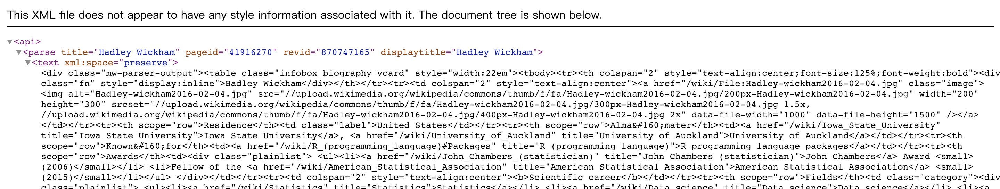

# CSS

Cascading Style Sheets

adding design information to HTML web pages


<input type="checkbox" id="checkbox1" class="styled">这样的高亮很不错，我继续对json等格式这样使用。


```css
.class_a {
color: black; }
.class_b {
color: red; }
```

对应的html

```html
<a class = "class_a" href = "http://en.wikipedia.org/"> This is black </a> 
<a class = "class_b" href = "http://en.wikipedia.org/"> This is red </a>
```

>
`html_nodes()` since you'll often want more than one node returned

意思等价于 
`html_nodes()`=`xml_find_all`

>
1. Use the CSS selector `"table"` to select all elements that are a `table` tag.
1. Use the CSS selector `".infobox"` to select all elements that have the attribute `class = "infobox"`.
1. Use the CSS selector `"#firstHeading"` to select all elements that have the attribute `id = "firstHeading"`

```{r}
# Select the table elements
html_nodes(test_xml, css = "table")

# Select elements with class = "infobox"
html_nodes(test_xml, css = ".infobox")

# Select elements with id = "firstHeading"
html_nodes(test_xml, css = "#firstHeading")
```


```{r}

```

如图这是 Wiki 一个 
[API页面](https://en.wikipedia.org/w/api.php?action=parse&page=Hadley%20Wickham&format=xml) XML 语言的截图。

链接是
https://en.wikipedia.org/w/api.php?action=parse&page=Hadley%20Wickham&format=xml

使用GET请求，把query填充。

```{r}
# Load httr
library(httr)

# The API url
base_url <- "https://en.wikipedia.org/w/api.php"

# Set query parameters
query_params <- list(action = "parse", 
  page = "Hadley Wickham", 
  format = "xml")

# Get data from API
resp <- GET(url = base_url, query = query_params)
    
# Parse response
resp_xml <- content(resp)
```

因此对于

```html
<h1 class = "heading" id = "intro">
  Introduction
</h1>
```

`".heading"`和`"#intro"`等价。

```{r}
library(rvest)
test <- read_html('
   <h1 class = "main">Hello world!</h1>
   ')
```

<input type="checkbox" id="checkbox1" class="styled">可以用这样的格式来练习。

对于`html_text`也是要指定tag的

```{r}
html_text(html_node(test, css = ".main"))
```

<input type="checkbox" id="checkbox1" class="styled">感觉记录的东西有点乱

<input type="checkbox" id="checkbox1" class="styled">再整合下 CSS 的 视频内容


下面这个例子非常有意义
链接了 httr, xml2 和 rvest
`read_html(xml_text(resp_xml))`

```{r}
# Load httr
library(httr)

# The API url
base_url <- "https://en.wikipedia.org/w/api.php"

# Set query parameters
query_params <- list(action = "parse", 
  page = "Hadley Wickham", 
  format = "xml")

# Get data from API
resp <- GET(url = base_url, query = query_params)
    
# Parse response
resp_xml <- content(resp)
```

```{r}
# Load rvest
library(rvest)

# Read page contents as HTML
page_html <- read_html(xml_text(resp_xml))

# Extract infobox element
infobox_element <- html_node(page_html,".infobox")

# Extract page name element from infobox
page_name <- html_node(page_html,".fn")

# Extract page name as text
page_title <- html_text(page_html)
```

都是这样么一个个取数，而非并行取的。

<input type="checkbox" id="checkbox1" class="styled">看下还有其他 Web 的课