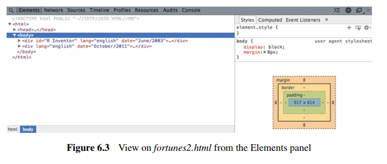
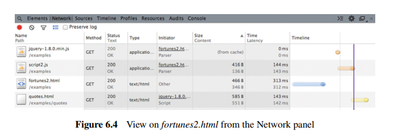
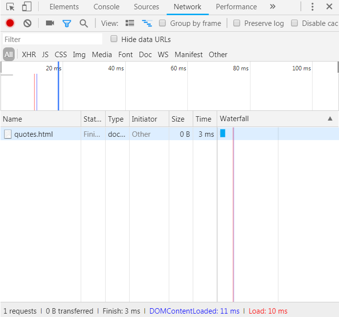
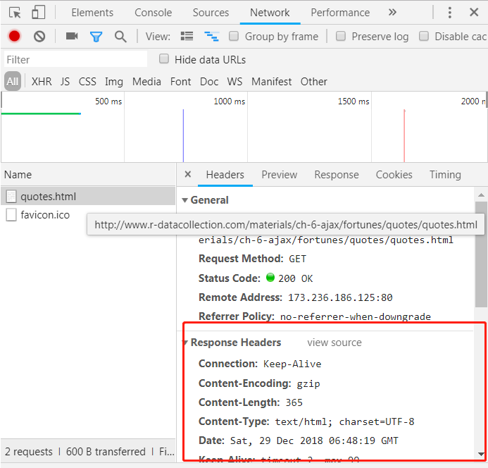

>
A prominent role in this transformation is assumed by agroup of technologies that are subsumed under the term AJAX, short for “AsynchronousJavaScript and XML.” AJAX has become a staple web technology to which we owe much ofthe sophistication of modern web applications such as Facebook, Twitter, the Google services,or any kind of shopping platform.

HTTP(s)主要适用于静态网页，但是AJAX作用于动态网页。

>
This presents a serious obstacle to analysts who care to collect web data since a simple HTTP GET request.

AJAX导致一般的 GET 请求都拿不到数据。

>
browser-implemented Developer Tools can be helpful for gathering insight into a page’s underlying structure as well as tracing the source of dynamic data requests.

一般的浏览器开发工具可以解决问题。

6.3 Exploring AJAX with Web Developer Tools

可以查看到

1. GET请求方式
1. Status状态是否报错
1. 文件type、大小、获取时间

点击Preview，可以查看具体可以复制粘贴的信息


```{r}


```

```{r}

```

>
Make sure to open the Network panel tab before loading a webpage, otherwise the request will not be captured. 

这里会发现，Network 没有加载的信息，那是因为需要先把 Network 打开，再刷新网页。

http://www.r-datacollection.com/materials/ch-6-ajax/fortunes/quotes/quotes.html

```{r}

```

